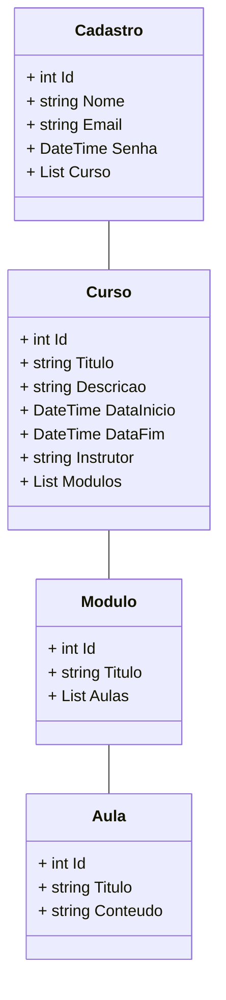

# Diagrama de Classes  - CD


```sh
 - Comoda novo projeto

    dotnet new webapi --name Api/SistemaCursosDistancia
    add file readme.md
    add file .gitignore
     
    dotnet tool install --global dotnet-ef
    dotnet tool update --global dotnet-ef

    dotnet add package Microsoft.EntityFrameworkCore
    dotnet add package Microsoft.EntityFrameworkCore.Design
    dotnet add package Microsoft.EntityFrameworkCore.SqlServer

 - Pacote de instalacao Microsoft.Data.SqlClient do SQL Server e ADO.NET

    dotnet add package Microsoft.Data.SqlClient --version 5.2.0-preview3.23201.1
```


```sh
add file Models no diretorio do projeto.
add class Cadastro dentro da Models com os seguintes atributos:

class Cadastro
          {
              public int Id { get; set; }
              public string Nome { get; set; }
              public string email { get; set; }
              public string senha { get; set; }
              public List<CursoCD> CursoCDs { get; set; }    
          }

add class curso dentro da Models com os seguintes atributos:

          class CursoCD
          {
              public int Id { get; set; }
              public string Titulo { get; set; }
              public string Descricao { get; set; }
              public DateTime DataInicio { get; set; }
              public DateTime DataFim { get; set; }
              public string Instrutor { get; set; }
              public List<ModuloCD> ModuloCDs { get; set; }
          }


add class Modulo dentro da Models com os seguintes atributos:

          class ModuloCD
          {
              public int Id { get; set; }
              public string Titulo { get; set; }
              public List<AulaCD> AulaCDs { get; set; }
          }

add class Modulo dentro da Models com os seguintes atributos:

          public class AulaCD
          {
              public int Id { get; set; }
              public string Titulo { get; set; }
              public string Conteudo { get; set; }
              public string arquivo {get; set;} 
          }

```

## Context
```sh
      add file Context no diretorio do projeto.
      add class CursoDistanciaContext dentro da Context para mapear as entidades do aplicativo para as tabelas do banco de dados e estabelecer a conexão com o banco de dados.

   - `Construtor`
     O construtor do contexto é responsável por configurar a conexão com o banco de dados usando as opções fornecidas durante a injeção de dependência.
 
            public CursoDistanciaContext(DbContextOptions<CursoDistanciaContext> options) :base(options)
            {

            }

            public DbSet<CadastroCD> CadastroCDs {get; set;}
            public DbSet<AulaCD> AulaCDs {get; set;}
            public DbSet<CursoCD> CursoCDs {get; set;}
            public DbSet<ModuloCD> ModuloCDs {get; set;}


  - Entidades Mapeadas

      - `Cadastros`: Representa os registros de usuários cadastrados no sistema.
      - `Aulas`: Representa informações sobre as aulas dos cursos, incluindo títulos, conteúdo e arquivos associados.
      - `Cursos`: Representa informações sobre os cursos oferecidos, incluindo títulos, descrições, datas de início e término e   instrutores.
      - `Modulos`: Representa os módulos de um curso, que contêm aulas relacionadas.
```

## ConnectionStrings
```sh

,
  "ConnectionStrings": {
    "ConexaoPadrao":"Server=localhost\\SqlExpress; Initial Catalog=ApiCursoAdistancia;Integrated Security=True; TrustServerCertificate=True"
  }

```

## Configuração do DbContext

```sh
  Nesta parte do código, estamos configurando o contexto do banco de dados para a aplicação. O contexto do banco 
  de dados é uma parte essencial de aplicativos que interagem com bancos de dados SQL. Neste caso, estamos usando 
  o Entity Framework Core para lidar com as operações de banco de dados.

  builder.Services.AddDbContext<MaisEventosVsCodeContextApi>(
      options =>
          options.UseSqlServer(
              builder.Configuration.GetConnectionString("ConexaoPadrao")
          ));

```
## Migrations
```sh

dotnet-ef migrations add ApiCursoDistancia
dotnet-ef database update

```

## Documentacao da API
```sh
Configuração do Swagger

A configuração do Swagger foi feita da seguinte forma:

- `Título:` Sistema de Cursos a Distância API
- `Versão:` v1
- `Descrição:` API desenvolvida para o site do Sistema de Cursos a Distância.
- `Termos de Serviço:` [Termos de Serviço](https://meusite.com)
- `Contato:` Victor Sérgio, [meusite.com](https://meusite.com)
- ``Licença:` Curso a Distância ApTech, [Detalhes da Licença](https://meusite.com)

Endpoints da API

A API fornece os seguintes endpoints:

- **[GET] /api/cursos**: Retorna a lista de todos os cursos.
- **[GET] /api/cursos/{id}**: Retorna os detalhes de um curso específico.
- **[POST] /api/cursos**: Cria um novo curso.
- **[PUT] /api/cursos/{id}**: Atualiza os detalhes de um curso.
- **[DELETE] /api/cursos/{id}**: Exclui um curso.

Você pode encontrar mais informações sobre cada endpoint, incluindo detalhes dos parâmetros, na documentação interativa do Swagger.

Como Usar

Aqui você pode fornecer instruções sobre como usar a API. Isso pode incluir exemplos de solicitações, respostas e autenticação, dependendo da complexidade da sua API.

```

## IRepository - Interface de Repositório Genérica 

```sh

A `IRepository` é uma interface genérica que define métodos comuns para realizar operações CRUD (Create, Read, Update, Delete) em objetos de diversas classes, incluindo `Cadastro`, `Aula`, `Curso` e `Módulo`, no contexto de um sistema de cursos a distância.

### Métodos Comuns

A interface `IRepository` inclui os seguintes métodos comuns:

- `GetALL()`: Retorna uma coleção de todos os registros do tipo especificado.
- `GetById(int Id)`: Retorna um registro com base no ID especificado.
- `Insert(int Id, T entity)`: Insere um novo registro no repositório.
- `Update(int ID, T entity)`: Atualiza um registro existente com base no ID.
- `Delete(int Id)`: Exclui um registro com base no ID e retorna um valor booleano indicando o sucesso da operação.

### Implementação Específica

A interface genérica `IRepository` pode ser implementada para realizar operações de CRUD em várias classes, incluindo `Cadastro`, `Aula`, `Curso` e `Módulo`. Cada classe específica pode fornecer sua própria implementação da interface, adaptada às suas necessidades.

Isso oferece flexibilidade e reutilização de código ao lidar com diferentes tipos de entidades no sistema de cursos a distância.

```


## Referencia
```sh
    https://learn.microsoft.com/pt-br/dotnet/framework/data/adonet/
    https://learn.microsoft.com/pt-br/sql/connect/ado-net/sql/?view=sql-server-ver16
    https://www.nuget.org/
```    

## Contribuições

Você é bem-vindo para contribuir para este projeto. Sinta-se à vontade para abrir problemas (issues) ou enviar solicitações de pull (pull requests) para melhorar esta API.

```


