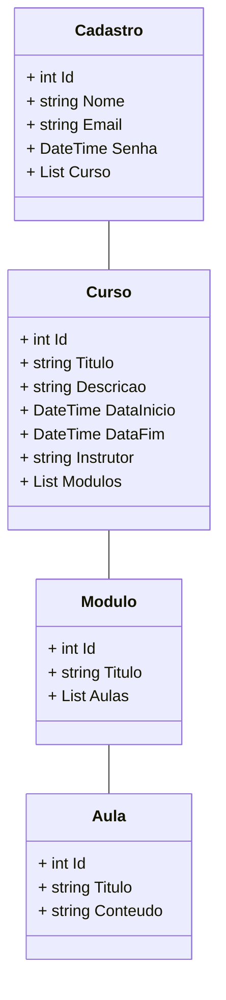

# Diagrama de Classes  - CD


```sh
 - Comoda novo projeto

    dotnet new webapi --name Api/SistemaCursosDistancia
    add file readme.md
    add file .gitignore
     
    dotnet tool install --global dotnet-ef
    dotnet tool update --global dotnet-ef

    dotnet add package Microsoft.EntityFrameworkCore
    dotnet add package Microsoft.EntityFrameworkCore.Design
    dotnet add package MySql.EntityFrameworkCore

 - Pacote de instalacao Microsoft.Data.SqlClient do SQL Server e ADO.NET

    dotnet add package Microsoft.Data.SqlClient --version 5.2.0-preview3.23201.1
```


```sh
add file Models no diretorio do projeto.
add class Cadastro dentro da Models com os seguintes atributos:

class Cadastro
          {
              public int Id { get; set; }
              public string Nome { get; set; }
              public string email { get; set; }
              public string senha { get; set; }
              public List<Curso> Curso { get; set; }    
          }

add class curso dentro da Models com os seguintes atributos:

          class Curso
          {
              public int Id { get; set; }
              public string Titulo { get; set; }
              public string Descricao { get; set; }
              public DateTime DataInicio { get; set; }
              public DateTime DataFim { get; set; }
              public string Instrutor { get; set; }
              public List<Modulo> Modulos { get; set; }
          }


add class Modulo dentro da Models com os seguintes atributos:

          class Modulo
          {
              public int Id { get; set; }
              public string Titulo { get; set; }
              public List<Aula> Aulas { get; set; }
          }

add class Modulo dentro da Models com os seguintes atributos:

          public class Aula
          {
              public int Id { get; set; }
              public string Titulo { get; set; }
              public string Conteudo { get; set; }
              public string arquivo {get; set;} 
          }

```

## Context
```sh
      add file Context no diretorio do projeto.
      add class CursoDistanciaContext dentro da Context para mapear as entidades do aplicativo para as tabelas do banco de dados e estabelecer a conexão com o banco de dados.

   - `Construtor`
     O construtor do contexto é responsável por configurar a conexão com o banco de dados usando as opções fornecidas durante a injeção de dependência.
 
            public CursoDistanciaContext(DbContextOptions<CursoDistanciaContext> options) :base(options)
            {

            }

            public DbSet<Cadastro> Cadastros {get; set;}
            public DbSet<Aula> Aulas {get; set;}
            public DbSet<Curso> Cursos {get; set;}
            public DbSet<Modulo> Modulos {get; set;}


  - Entidades Mapeadas

      - `Cadastros`: Representa os registros de usuários cadastrados no sistema.
      - `Aulas`: Representa informações sobre as aulas dos cursos, incluindo títulos, conteúdo e arquivos associados.
      - `Cursos`: Representa informações sobre os cursos oferecidos, incluindo títulos, descrições, datas de início e término e   instrutores.
      - `Modulos`: Representa os módulos de um curso, que contêm aulas relacionadas.
```

## Referencia
```sh
    https://learn.microsoft.com/pt-br/dotnet/framework/data/adonet/
    https://learn.microsoft.com/pt-br/sql/connect/ado-net/sql/?view=sql-server-ver16
    https://www.nuget.org/
```
