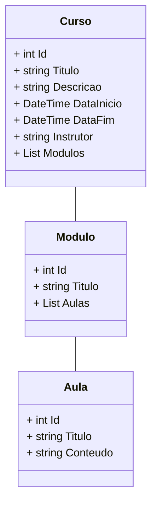

# Diagrama de Classes  - CD

```mermaid
classDiagram

class Curso {
  + int Id
  + string Titulo
  + string Descricao
  + DateTime DataInicio
  + DateTime DataFim
  + string Instrutor
  + List<Modulo> Modulos
}

class Modulo {
  + int Id
  + string Titulo
  + List<Aula> Aulas
}

class Aula {
  + int Id
  + string Titulo
  + string Conteudo
}

Curso "" -- "" Modulo 
Modulo "" -- "" Aula 

```