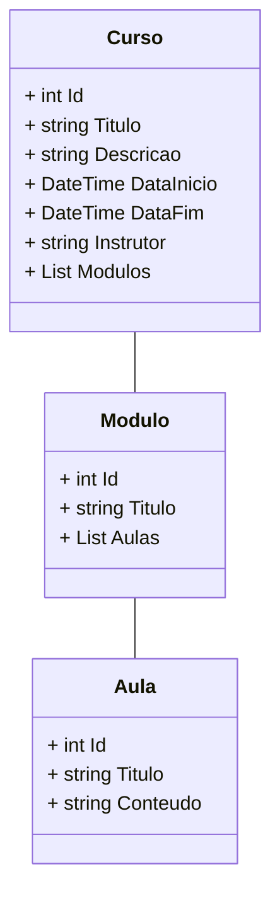

# Diagrama de Classes  - CD


```sh
 - Comoda novo projeto

    dotnet new webapi --name Api/SistemaCursosDistancia
    add file readme.md
    add file .gitignore
     
    dotnet tool install --global dotnet-ef
    dotnet tool update --global dotnet-ef

    dotnet add package Microsoft.EntityFrameworkCore
    dotnet add package Microsoft.EntityFrameworkCore.Design
    dotnet add package MySql.EntityFrameworkCore
```


```sh

class Curso {
    public int Id { get; set; }
    public string Titulo { get; set; }
    public string Descricao { get; set; }
    public DateTime DataInicio { get; set; }
    public DateTime DataFim { get; set; }
    public string Instrutor { get; set; }
    public List<Modulo> Modulos { get; set; }
}

```